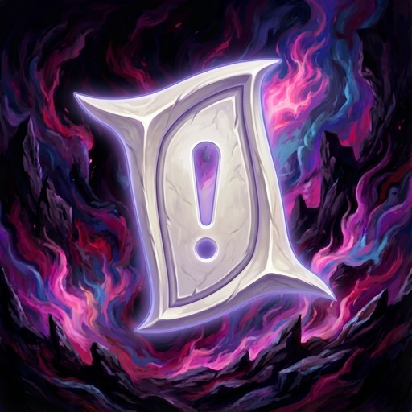

<p align="center">
  
</p>

<h1 align="center">Auto Triple Triad Grind</h1>

<p align="center">
  <a href="https://discord.gg/hppkAvdBEE"></a>
  <a href="https://github.com/XeldarAlz/FFXIV-AutoTripleTriadGrind/releases/latest"></a>
  <a href="https://github.com/XeldarAlz/FFXIV-AutoTripleTriadGrind/releases"></a>
  <a href="https://github.com/XeldarAlz/FFXIV-AutoTripleTriadGrind/actions/workflows/release.yml"></a>
  <a href="LICENSE.md"></a>
</p>

<p align="center">
  <em>Every NPC card, collected for you. Built on Dalamud.</em>
</p>

---

## What it does

Lists every Triple Triad card an NPC can give you, which ones you already own, and which NPCs drop each one. Pick single cards, whole NPCs, or every card you are missing, and press **Start**: the plugin plans a route, travels to each NPC, builds a deck for that NPC's rules, plays match after match until every card you picked from them has dropped, registers the cards, and moves on to the next NPC.

## Features

- **Card collection view**: every NPC reward card from A Realm Reborn through Dawntrail, grouped by expansion, by NPC or by card, with owned cards checked off.
- **Pick what you want**: click a card to pick it, click an NPC to pick everything you are missing from them, or pick every missing card at once.
- **Route planning**: each card goes to the NPC that also gives the most of your other picks, and NPCs are visited zone by zone so a run teleports as little as possible.
- **Deck building**: an optimized deck is built for each NPC from your own cards and that NPC's rules, including regional rules, or you can play one of your saved decks.
- **Auto-play**: plays every turn with a match solver that knows all sixteen rules, then asks for a rematch until the NPC has nothing left to give.
- **Card registration**: won cards are registered straight away, and the run pauses before your bags fill up.
- **Farm mode**: pick one or more NPCs and play them a set number of times or until you stop.
- **Skips instead of stalls**: locked NPCs, NPCs you keep losing to, and NPCs asking a higher fee than you allow are skipped and listed with the reason.
- **After-run action**: stay where you are, return to the inn, log out, or close the game once the route is done.
- **Pause & resume**: park a run without losing your progress, and auto-pause while you're in a duty.
- **Party invites**: auto-declines incoming invites during a run after a random delay, with an optional reply message.
- **GM alert**: stops the bot when a GM is near, with optional toast, beeps, or custom commands.
- **History**: every run recorded with matches won, NPCs finished, and the cards you got.

## Install

In-game: `/xlsettings` → **Experimental** → paste into **Custom Plugin Repositories**:

```
https://raw.githubusercontent.com/XeldarAlz/DalamudPlugins/main/repo.json
```

Tick **Enabled**, click **+**, then **Save and Close**. Open `/xlplugins` → **All Plugins**, search for **Auto Triple Triad Grind**, and install.

The plugin needs a movement helper to be installed and loaded. Open `/attg deps` after install to see it and install it with one click.

## Commands

| Command | Action |
|---|---|
| `/attg` | Toggle the main window |
| `/tripletriad` | Alias for `/attg` |
| `/attg config` | Open the Settings page |
| `/attg stats` | Open the History page |
| `/attg deps` | Open the Plugins page |
| `/attg log` | Open the Console page |
| `/attg changelog` | Open the Changelog page |
| `/attg about` | Open the About page |
| `/attg pause` | Pause or resume the current run |
| `/attg npcs` | Write the Triple Triad NPC table to the plugin log (debug helper) |
| `/attg board` | Print what the plugin reads off an open match board (debug helper) |
| `/attg request` | Print the regional rules read off an open challenge window (debug helper) |
| `/attg goto <territory> <x> <y> <z>` | Travel to a point, `/attg goto stop` cancels (debug helper) |

## Languages

The windows are available in English, Deutsch, Français, Español, Português (Brasil), Русский, Türkçe, 日本語, and 中文. The plugin picks a language from your Dalamud and game client settings on first launch; change it any time under Settings, General, Language. Game data such as card, NPC, and zone names always follows the game client.

Spotted a wrong or awkward translation? Open a [translation issue](https://github.com/XeldarAlz/FFXIV-AutoTripleTriadGrind/issues/new?template=translation_report.yml) and tell me what it should say instead.

## Community

Questions, ideas, or just want to hang out with other players? Come say hi on Discord.

→ [Join our Discord](https://discord.gg/hppkAvdBEE)

## More from me

If you liked this plugin, take a look at my other Dalamud work. You might find something else there for you.

→ [XeldarAlz Dalamud Plugins](https://github.com/XeldarAlz/DalamudPlugins)

## License

AGPL-3.0-or-later. See [LICENSE.md](LICENSE.md). [NOTICE](NOTICE) adds the attribution terms the AGPL allows: a fork, or any project that reuses this code, must credit the original author and must not pass itself off as the original. The license covers the code, not the name or the icon: read the [trademark and naming policy](TRADEMARK.md) before you publish a fork. Third-party code notices are in [THIRD-PARTY-NOTICES.md](THIRD-PARTY-NOTICES.md).

How AI is used to build this plugin is written down in [AI usage](AI-USAGE.md).
